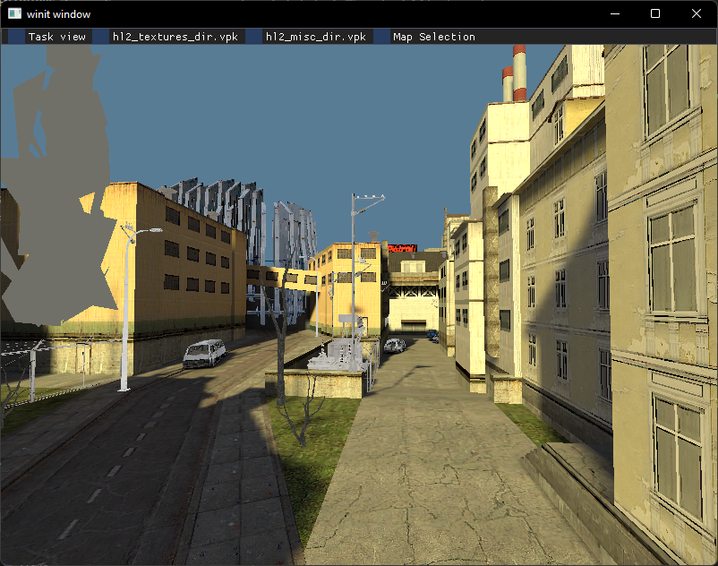

# BSP-RS

## Building on web

1. Run `wasm-pack build --dev` in `/bsp-web` to built the package.
2. Run `npm install` in `/bsp-web/www` on the first time running to init the packages.
3. Run `npm run start` in `/bsp-web/www` to start the dev server.

## TODO

- [x] Unify PakEntry and VPKEntry
- [ ] Better error handling
- [ ] fix missing displacement textures
- [x] improve material file parsing
- [ ] Attach materials as a component
- [x] load models (this was a pain)
    - [x] Instanced prop drawing
    - [x] Textured prop drawing
    - [ ] Lit prop drawing
- [x] stop rendering trigger volumes
- [x] respect shader request from material
- [ ] skybox
- [ ] 3d skybox
- [x] lightmap data
- [ ] convert lightmap data from storage array to texture atlas
- [ ] environment map reflections
- [ ] global renderer configs (lighting only, textures, faces, etc)
- [ ] Unified VBuffer object
- [x] Half Life 2
- [ ] Half Life 2 Ep 1
    - [ ] Weird lightmap data
- [ ] Half Life 2 Ep 2
- [x] Portal
- [ ] Portal 2
    - [ ] VMT files changed slightly
    - [ ] No lightmap data?
- [ ] TF2
- [ ] Unify getting texture reference from material
- [x] Web first playable
    - [ ] Move filesystem references from source package
    - [ ] Fix colour mismatch (srgb)
    - [x] Use egui
